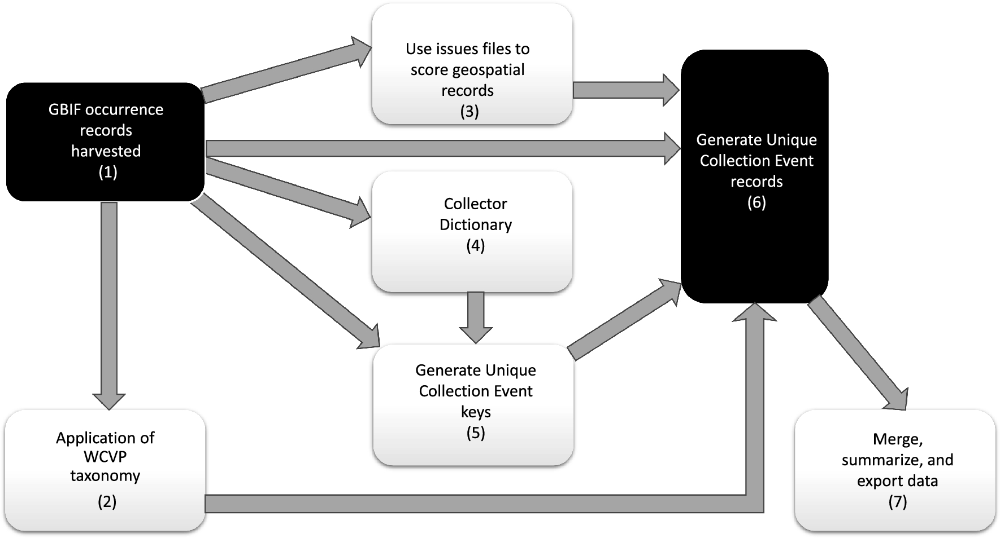
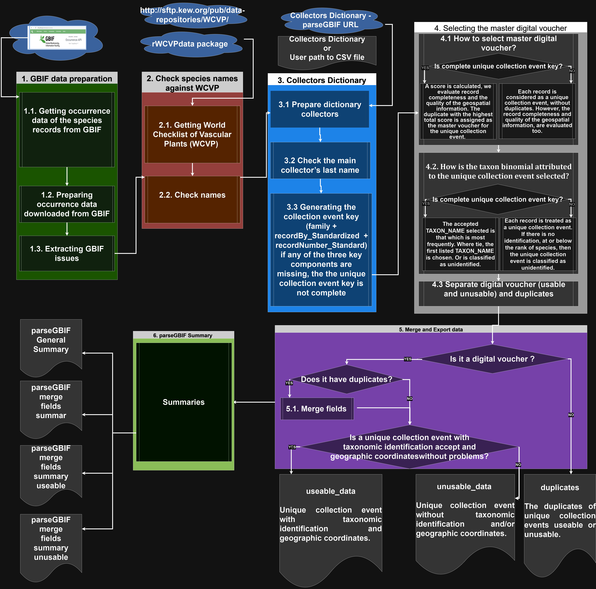

<!-- README.md is generated from README.Rmd. Please edit that file -->

# parseGBIF

<!-- badges: start -->

[](https://github.com/pablopains/parseGBIF/actions)
[](https://app.codecov.io/gh/pablopains/parseGBIF?branch=main)
[](https://github.com/pablopains/parseGBIF/actions/workflows/R-CMD-check.yaml)

<!-- badges: end -->

The parseGBIF package is designed to repackage [Global Biodiversity
Information Facility - GBIF](https://www.gbif.org/) species occurrence
records into a format that optimises its use in further analyses.
Currently occurrence records in GBIF can include several duplicate
digital records, and in the case of vascular plants, for several
physical duplicates of unique collection events (biological
collections). parseGBIF aims to parse these records to a single,
synthetic, record corresponding to a unique collection event to which a
standardized scientific name is associated. It does so by providing
tools to verify and standardize species scientific names, score the
quality of both the naming of a record and of its associated spatial
data, and to use those scores to synthesise and parse duplicate records
into unique collection events. This Manual provides a brief introduction
to parseGBIF, with more information available from Help pages accessed
via the help fuction. We believe that this package will be of particular
use for analyses of plant occurrence data.

## Installation

You can install the development version of parseGBIF from
[GitHub](https://github.com/pablopains/parseGBIF). To install parseGBIF,
run

``` r
devtools::install_github("pablopains/parseGBIF",
                           dependencies = TRUE)
```

## **Article with case study**

A new R package to parse plant species occurrence records into unique
collection events efficiently reduces data redundancy
[DOI:10.1038/s41598-024-56158-3](https://doi.org/10.1038/s41598-024-56158-3)

## **Presentation video**

[click here to watch](https://www.youtube.com/watch?v=3U7Fs7DuKyU)

## **Workflow**



## **Workflow performed in just a few clicks using the app**

We recommend using the application locally.

``` r
parseGBIF::parseGBIF_app()
```

## **For cloud computing we recommend opening the Jupyter notebook r providing the URL [parseGBIF_workflow.ipynb](https://raw.githubusercontent.com/pablopains/parseGBIF/main/Jupyter%20notebook/parseGBIF_workflow.ipynb) and running the workflow**

## **Consult the [parseGBIF Manual](https://github.com/pablopains/parseGBIF/blob/main/parseGBIF_Manual_v2.pdf), **updated**, for a case study with a complete and replicable workflow**

Please site parseGBIF as:

``` r
print(citation("parseGBIF"), bibtex = FALSE)
#> Para citar o pacote 'parseGBIF' em publicações use:
#> 
#>   de Melo P, Bystriakova N, Lucas E, Monro A (2024). "A new R package
#>   to parse plant species occurrence records into unique collection
#>   events efficiently reduces data redundancy." _Sci Rep_, *14*(5450),
#>   1-9. doi:10.1038/s41598-024-56158-3
#>   <https://doi.org/10.1038/s41598-024-56158-3>.
```

## **Workflow in detail**


